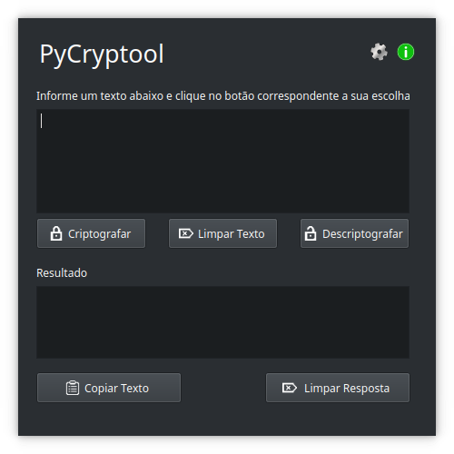

# PyCryptool 🔓

Favorite ⭐ o repositório se você gostar do que vê 😉.

## About
PyCryptool é um aplicativo para Linux, que permite permite criptografar e descriptografar textos de forma simples.

Para criptografar e descriptografar textos, é utilizado o [DartCryptoConsole](https://github.com/tglima/DartCrytoConsole), uma aplicação que funciona por meio de um utilitário de linha de comando.

Esta aplicação é uma alternativa ao [MyFlutterCrypto](https://github.com/tglima/myfluttercrypto)

## Requisitos
* Sistema operacional Linux X86_64 (ex. [Ubuntu](https://ubuntu.com/download), [Linux Mint](https://www.linuxmint.com/download.php), [Manjaro](https://manjaro.org/download/), [Fedora](https://fedoraproject.org/workstation/download/), etc.)
* [Python](https://www.python.org/downloads/)  v3.11.x
* [PySide6](https://www.pyside.org/) v6.5.x
    * PySide6-Addons v6.5.x
    * PySide6-Essentials v6.5.x
    * Shiboken6  v6.5.x
* Uma IDE com suporte ao Python e ao PySide (ex. [VSCode](https://code.visualstudio.com/Download), [PyCharm](https://www.jetbrains.com/pt-br/pycharm/download/?section=linux))

Para fazer o download da última versão disponível, visite a seção de [releases](https://github.com/tglima/pycryptool/releases).

### Recomendação
Para utilização do python e do pyside6, recomendo a utilização de uma ferramenta que permita gerenciar ambientes virtuais, podendo assim isolar pacotes e utilizar versões específicas do python sem interferir no sistema principal. Exemplos: [VirtualEnv](https://virtualenv.pypa.io/en/latest/), [Conda](https://docs.conda.io/projects/conda/en/stable/), [Pipenv](https://pipenv.pypa.io/en/latest/), etc.

## License
O código fonte desta aplicação está sob [Licença MIT](LICENSE), todo o restante deve ser considerado conteúdo registrado dos seus respectivos proprietários e desenvolvedores.

Muitos dos arquivos de imagens utilizados no projeto são provenientes do site [SVG Repo](https://www.svgrepo.com/). Esse site oferece uma ampla variedade de vetores e ícones em formato SVG, que podem ser baixados gratuitamente e utilizados em projetos comerciais sem a necessidade de pagamento de royalties.